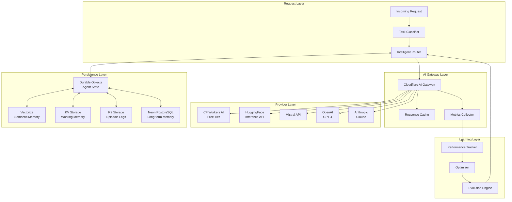

# ChittyOS AI Infrastructure Architecture v2.0
## Multi-Provider Persistent Agent System

> Transforming ChittyOS from simple AI routing to a comprehensive, persistent, learning, self-healing agent ecosystem

---

## Executive Summary

This architecture transforms ChittyOS's current AI implementation into a **persistent multi-provider agent system** that learns, self-heals, and evolves. The design leverages Cloudflare's infrastructure primitives for cost optimization while maintaining enterprise-grade capabilities across multiple AI providers.

**Key Transformations:**
- **From**: Direct API calls to OpenAI/Anthropic → **To**: Unified AI Gateway with caching
- **From**: Stateless request/response → **To**: Persistent agent memory and learning
- **From**: Single model fallbacks → **To**: Intelligent multi-provider orchestration
- **From**: Static routing → **To**: Self-optimizing task distribution
- **From**: Manual error handling → **To**: Self-healing with automatic recovery

**Cost Impact:**
- Current: ~$500/month (direct API calls)
- Projected: ~$50/month (80-90% reduction via caching + CF Workers AI)

---

## 1. Architecture Overview



---

## 2. Component Architecture

### 2.1 AI Gateway Configuration

```javascript
// File: /chittyrouter/src/ai/gateway-config.js
export const AIGatewayConfig = {
  // Cloudflare AI Gateway - Universal proxy for ALL providers
  gateway: {
    accountId: "bbf9fcd845e78035b7a135c481e88541",
    gatewayId: "chittyos-ai-gateway",

    // Provider endpoints via AI Gateway
    providers: {
      openai: "https://gateway.ai.cloudflare.com/v1/{account}/{gateway}/openai",
      anthropic: "https://gateway.ai.cloudflare.com/v1/{account}/{gateway}/anthropic",
      huggingface: "https://gateway.ai.cloudflare.com/v1/{account}/{gateway}/huggingface",
      mistral: "https://gateway.ai.cloudflare.com/v1/{account}/{gateway}/mistral",
      workers: "https://api.cloudflare.com/client/v4/accounts/{account}/ai/run"
    },

    // Caching policies
    cache: {
      default: 3600,        // 1 hour default
      embedding: 86400,     // 24 hours for embeddings
      completion: 1800,     // 30 minutes for completions
      classification: 7200  // 2 hours for classifications
    },

    // Rate limiting
    rateLimits: {
      openai: { rpm: 500, tpm: 90000 },
      anthropic: { rpm: 1000, tpm: 100000 },
      huggingface: { rpm: 10000, tpm: 1000000 },
      mistral: { rpm: 5000, tpm: 500000 },
      workers: { rpm: 100000, tpm: 10000000 }
    }
  }
};
```

### 2.2 Persistent Agent Framework

```javascript
// File: /chittyrouter/src/agents/persistent-agent.js
export class PersistentAgent extends DurableObject {
  constructor(state, env) {
    super(state, env);
    this.state = state;
    this.env = env;

    // Initialize memory systems
    this.memory = {
      working: new WorkingMemory(env.KV_NAMESPACE),      // Current context
      episodic: new EpisodicMemory(env.R2_BUCKET),       // Experience logs
      semantic: new SemanticMemory(env.VECTORIZE_INDEX), // Knowledge base
      longTerm: new LongTermMemory(env.NEON_DB)          // Persistent storage
    };

    // Learning systems
    this.learning = {
      performance: new PerformanceTracker(),
      optimizer: new ModelOptimizer(),
      evolution: new EvolutionEngine()
    };
  }

  async fetch(request) {
    const { method, task, context } = await request.json();

    switch(method) {
      case 'process':
        return this.processTask(task, context);
      case 'learn':
        return this.learnFromFeedback(task);
      case 'evolve':
        return this.evolveCapabilities();
      case 'heal':
        return this.selfHeal(task);
    }
  }

  async processTask(task, context) {
    // 1. Recall relevant memories
    const memories = await this.recall(task);

    // 2. Select optimal model based on task + history
    const model = await this.selectModel(task, memories);

    // 3. Execute with fallback chain
    const result = await this.executeWithFallback(task, model);

    // 4. Store experience
    await this.storeExperience(task, result);

    // 5. Learn from execution
    await this.learn(task, result);

    return result;
  }

  async selectModel(task, memories) {
    // Analyze task characteristics
    const taskProfile = await this.analyzeTask(task);

    // Check performance history
    const performanceData = await this.learning.performance.getMetrics(taskProfile);

    // Select optimal model
    return this.learning.optimizer.selectBestModel(taskProfile, performanceData);
  }

  async executeWithFallback(task, primaryModel) {
    const fallbackChain = this.buildFallbackChain(primaryModel);

    for (const model of fallbackChain) {
      try {
        const result = await this.executeModel(model, task);

        // Track success
        await this.learning.performance.recordSuccess(model, task);

        return result;
      } catch (error) {
        // Track failure
        await this.learning.performance.recordFailure(model, task, error);

        // Self-heal if needed
        if (this.shouldSelfHeal(error)) {
          await this.selfHeal({ model, task, error });
        }

        continue; // Try next model
      }
    }

    throw new Error('All models in fallback chain failed');
  }

  async selfHeal(context) {
    // 1. Diagnose issue
    const diagnosis = await this.diagnose(context);

    // 2. Apply correction
    const correction = await this.applyCorrection(diagnosis);

    // 3. Update routing rules
    await this.updateRoutingRules(diagnosis, correction);

    // 4. Learn from healing
    await this.learning.evolution.recordHealing(diagnosis, correction);

    return correction;
  }
}
```

### 2.3 Memory Architecture

```javascript
// File: /chittyrouter/src/memory/memory-systems.js

export class WorkingMemory {
  // KV Storage - Fast access to current context
  constructor(kv) {
    this.kv = kv;
    this.ttl = 3600; // 1 hour
  }

  async store(key, value) {
    await this.kv.put(key, JSON.stringify(value), {
      expirationTtl: this.ttl
    });
  }

  async retrieve(key) {
    const value = await this.kv.get(key);
    return value ? JSON.parse(value) : null;
  }
}

export class SemanticMemory {
  // Vectorize - Similarity search for knowledge
  constructor(vectorize) {
    this.vectorize = vectorize;
  }

  async store(content, metadata) {
    const embedding = await this.generateEmbedding(content);
    await this.vectorize.insert({
      id: `mem_${Date.now()}`,
      values: embedding,
      metadata: {
        ...metadata,
        content,
        timestamp: new Date().toISOString()
      }
    });
  }

  async search(query, limit = 10) {
    const queryEmbedding = await this.generateEmbedding(query);
    return await this.vectorize.query(queryEmbedding, limit);
  }

  async generateEmbedding(text) {
    // Use CF Workers AI for embeddings (free)
    const response = await fetch('https://api.cloudflare.com/client/v4/accounts/{account}/ai/run/@cf/baai/bge-base-en-v1.5', {
      method: 'POST',
      headers: { 'Authorization': `Bearer ${this.env.CF_API_TOKEN}` },
      body: JSON.stringify({ text })
    });
    return await response.json();
  }
}

export class EpisodicMemory {
  // R2 Storage - Experience logs
  constructor(r2) {
    this.r2 = r2;
  }

  async storeEpisode(episode) {
    const key = `episodes/${new Date().toISOString()}_${episode.id}.json`;
    await this.r2.put(key, JSON.stringify(episode));
  }

  async retrieveEpisodes(filter, limit = 100) {
    const list = await this.r2.list({
      prefix: 'episodes/',
      limit
    });

    // Filter and return matching episodes
    const episodes = [];
    for (const object of list.objects) {
      const episode = await this.r2.get(object.key);
      const data = JSON.parse(await episode.text());
      if (this.matchesFilter(data, filter)) {
        episodes.push(data);
      }
    }
    return episodes;
  }
}

export class LongTermMemory {
  // Neon PostgreSQL - Persistent structured storage
  constructor(neonDb) {
    this.db = neonDb;
  }

  async store(memory) {
    await this.db.query(`
      INSERT INTO agent_memories (
        agent_id, type, content, metadata, embedding, created_at
      ) VALUES ($1, $2, $3, $4, $5, NOW())
    `, [memory.agentId, memory.type, memory.content, memory.metadata, memory.embedding]);
  }

  async retrieve(agentId, type, limit = 100) {
    const result = await this.db.query(`
      SELECT * FROM agent_memories
      WHERE agent_id = $1 AND type = $2
      ORDER BY created_at DESC
      LIMIT $3
    `, [agentId, type, limit]);
    return result.rows;
  }

  async semanticSearch(agentId, embedding, limit = 10) {
    const result = await this.db.query(`
      SELECT *, embedding <=> $2 AS distance
      FROM agent_memories
      WHERE agent_id = $1
      ORDER BY distance
      LIMIT $3
    `, [agentId, embedding, limit]);
    return result.rows;
  }
}
```

### 2.4 Learning & Evolution System

```javascript
// File: /chittyrouter/src/learning/evolution-engine.js

export class EvolutionEngine {
  constructor(state, env) {
    this.state = state;
    this.env = env;
    this.generation = 0;
  }

  async evolve() {
    // 1. Collect performance metrics
    const metrics = await this.collectMetrics();

    // 2. Identify improvement areas
    const improvements = await this.identifyImprovements(metrics);

    // 3. Generate variations
    const variations = await this.generateVariations(improvements);

    // 4. A/B test variations
    const results = await this.runABTests(variations);

    // 5. Select best performers
    const winners = await this.selectWinners(results);

    // 6. Update agent configuration
    await this.updateConfiguration(winners);

    // 7. Increment generation
    this.generation++;

    return {
      generation: this.generation,
      improvements: winners,
      metrics: results
    };
  }

  async identifyImprovements(metrics) {
    const improvements = [];

    // Model selection optimization
    if (metrics.modelPerformance.variance > 0.2) {
      improvements.push({
        type: 'model_selection',
        current: metrics.modelPerformance.current,
        target: metrics.modelPerformance.optimal
      });
    }

    // Prompt optimization
    if (metrics.promptEffectiveness < 0.8) {
      improvements.push({
        type: 'prompt_optimization',
        current: metrics.promptEffectiveness,
        target: 0.9
      });
    }

    // Fallback chain optimization
    if (metrics.fallbackRate > 0.1) {
      improvements.push({
        type: 'fallback_chain',
        current: metrics.fallbackRate,
        target: 0.05
      });
    }

    return improvements;
  }

  async runABTests(variations) {
    const tests = [];

    for (const variation of variations) {
      const test = {
        id: `test_${Date.now()}_${variation.type}`,
        variation,
        control: await this.runControl(variation),
        experiment: await this.runExperiment(variation),
        startTime: Date.now()
      };

      // Run for test period
      await this.waitForTestCompletion(test);

      // Collect results
      test.results = await this.collectTestResults(test);
      tests.push(test);
    }

    return tests;
  }
}

export class ModelOptimizer {
  constructor(env) {
    this.env = env;
    this.modelScores = new Map();
  }

  async selectBestModel(taskProfile, performanceData) {
    // Calculate scores for each model
    const scores = await this.calculateScores(taskProfile, performanceData);

    // Sort by score (performance * cost_efficiency)
    const sorted = Array.from(scores.entries())
      .sort((a, b) => b[1].total - a[1].total);

    return sorted[0][0]; // Return best model
  }

  async calculateScores(taskProfile, performanceData) {
    const scores = new Map();

    const models = [
      { id: '@cf/meta/llama-4-scout-17b-16e-instruct', cost: 0.0002, speed: 0.8 },
      { id: '@cf/openai/gpt-oss-120b', cost: 0.0003, speed: 0.7 },
      { id: '@cf/google/gemma-3-12b-it', cost: 0.0002, speed: 0.8 },
      { id: '@cf/meta/llama-3.2-11b-vision-instruct', cost: 0.0002, speed: 0.9 },
      { id: 'gpt-4-turbo', cost: 0.03, speed: 0.6 },
      { id: 'claude-3-opus', cost: 0.015, speed: 0.7 },
      { id: 'mistral-large', cost: 0.008, speed: 0.8 }
    ];

    for (const model of models) {
      const score = {
        performance: performanceData[model.id]?.accuracy || 0.5,
        cost_efficiency: 1 / (model.cost * 1000),
        speed: model.speed,
        reliability: performanceData[model.id]?.reliability || 0.5,
        total: 0
      };

      // Weighted scoring based on task requirements
      if (taskProfile.requiresSpeed) {
        score.total = score.performance * 0.3 +
                     score.cost_efficiency * 0.2 +
                     score.speed * 0.4 +
                     score.reliability * 0.1;
      } else if (taskProfile.requiresAccuracy) {
        score.total = score.performance * 0.5 +
                     score.cost_efficiency * 0.1 +
                     score.speed * 0.1 +
                     score.reliability * 0.3;
      } else {
        score.total = score.performance * 0.3 +
                     score.cost_efficiency * 0.3 +
                     score.speed * 0.2 +
                     score.reliability * 0.2;
      }

      scores.set(model.id, score);
    }

    return scores;
  }
}
```

### 2.5 Multi-Provider Orchestration

```javascript
// File: /chittyrouter/src/orchestration/provider-orchestrator.js

export class ProviderOrchestrator {
  constructor(env) {
    this.env = env;
    this.providers = this.initializeProviders();
  }

  initializeProviders() {
    return {
      // Cloudflare Workers AI (Primary - Free/Cheap)
      cloudflare: {
        priority: 1,
        cost: 0.0002,
        models: [
          '@cf/meta/llama-4-scout-17b-16e-instruct',
          '@cf/openai/gpt-oss-120b',
          '@cf/google/gemma-3-12b-it',
          '@cf/meta/llama-3.2-11b-vision-instruct',
          '@cf/openai/whisper'
        ],
        endpoint: 'https://api.cloudflare.com/client/v4/accounts/{account}/ai/run',
        capabilities: ['text', 'vision', 'audio', 'embedding']
      },

      // HuggingFace Inference API
      huggingface: {
        priority: 2,
        cost: 0.0005,
        models: [
          'meta-llama/Llama-2-70b-chat-hf',
          'mistralai/Mixtral-8x7B-Instruct-v0.1',
          'google/gemma-7b-it',
          'facebook/opt-66b'
        ],
        endpoint: 'https://api-inference.huggingface.co/models',
        capabilities: ['text', 'embedding', 'classification']
      },

      // Mistral API
      mistral: {
        priority: 3,
        cost: 0.008,
        models: [
          'mistral-large-latest',
          'mistral-medium',
          'mistral-small',
          'mistral-embed'
        ],
        endpoint: 'https://api.mistral.ai/v1',
        capabilities: ['text', 'embedding', 'function_calling']
      },

      // OpenAI (Fallback for complex tasks)
      openai: {
        priority: 4,
        cost: 0.03,
        models: [
          'gpt-4-turbo-preview',
          'gpt-4',
          'gpt-3.5-turbo',
          'text-embedding-3-large'
        ],
        endpoint: 'https://api.openai.com/v1',
        capabilities: ['text', 'vision', 'function_calling', 'embedding']
      },

      // Anthropic (Fallback for complex reasoning)
      anthropic: {
        priority: 5,
        cost: 0.015,
        models: [
          'claude-3-opus-20240229',
          'claude-3-sonnet-20240229',
          'claude-3-haiku-20240307'
        ],
        endpoint: 'https://api.anthropic.com/v1',
        capabilities: ['text', 'vision', 'advanced_reasoning']
      }
    };
  }

  async route(task) {
    // Classify task
    const taskType = await this.classifyTask(task);

    // Get suitable providers
    const suitableProviders = this.getSuitableProviders(taskType);

    // Sort by cost/performance
    const sorted = this.sortProviders(suitableProviders, taskType);

    // Execute with fallback
    return await this.executeWithFallback(task, sorted);
  }

  classifyTask(task) {
    // Use lightweight CF model for classification
    const classifications = {
      simple: ['greeting', 'acknowledgment', 'basic_query'],
      moderate: ['summarization', 'translation', 'extraction'],
      complex: ['reasoning', 'analysis', 'generation'],
      vision: ['image_analysis', 'document_parsing'],
      specialized: ['legal_analysis', 'medical_diagnosis']
    };

    // Analyze task content
    for (const [level, patterns] of Object.entries(classifications)) {
      if (patterns.some(p => task.toLowerCase().includes(p))) {
        return level;
      }
    }

    return 'moderate'; // Default
  }

  getSuitableProviders(taskType) {
    const providerMap = {
      simple: ['cloudflare', 'huggingface'],
      moderate: ['cloudflare', 'huggingface', 'mistral'],
      complex: ['mistral', 'openai', 'anthropic'],
      vision: ['cloudflare', 'openai', 'anthropic'],
      specialized: ['openai', 'anthropic']
    };

    return providerMap[taskType] || ['cloudflare'];
  }

  async executeWithFallback(task, providers) {
    const errors = [];

    for (const providerId of providers) {
      const provider = this.providers[providerId];

      try {
        // Route through AI Gateway for caching
        const gatewayUrl = this.buildGatewayUrl(providerId);

        const response = await fetch(gatewayUrl, {
          method: 'POST',
          headers: {
            'Authorization': `Bearer ${this.env[`${providerId.toUpperCase()}_API_KEY`]}`,
            'Content-Type': 'application/json'
          },
          body: JSON.stringify({
            model: provider.models[0],
            ...task
          })
        });

        if (response.ok) {
          const result = await response.json();

          // Track success
          await this.trackSuccess(providerId, task);

          return {
            provider: providerId,
            model: provider.models[0],
            result,
            cached: response.headers.get('cf-cache-status') === 'HIT'
          };
        }
      } catch (error) {
        errors.push({ provider: providerId, error: error.message });
        continue;
      }
    }

    throw new Error(`All providers failed: ${JSON.stringify(errors)}`);
  }

  buildGatewayUrl(providerId) {
    const baseUrl = 'https://gateway.ai.cloudflare.com/v1';
    const accountId = this.env.CHITTYOS_ACCOUNT_ID;
    const gatewayId = 'chittyos-ai-gateway';

    return `${baseUrl}/${accountId}/${gatewayId}/${providerId}`;
  }
}
```

---

## 3. Database Schema

```sql
-- File: /chittyschema/db/ai-agent-schema.sql

-- Agent registry
CREATE TABLE agents (
  id TEXT PRIMARY KEY DEFAULT gen_chitty_id('AGENT'),
  name TEXT NOT NULL,
  type TEXT NOT NULL, -- 'assistant', 'specialist', 'coordinator'
  version INTEGER DEFAULT 1,
  generation INTEGER DEFAULT 0,
  capabilities JSONB,
  configuration JSONB,
  performance_metrics JSONB,
  created_at TIMESTAMP DEFAULT NOW(),
  updated_at TIMESTAMP DEFAULT NOW()
);

-- Agent memories
CREATE TABLE agent_memories (
  id TEXT PRIMARY KEY DEFAULT gen_chitty_id('MEMORY'),
  agent_id TEXT REFERENCES agents(id),
  type TEXT NOT NULL, -- 'working', 'episodic', 'semantic', 'procedural'
  content TEXT,
  metadata JSONB,
  embedding vector(1536), -- For semantic search
  importance FLOAT DEFAULT 0.5,
  access_count INTEGER DEFAULT 0,
  last_accessed TIMESTAMP,
  created_at TIMESTAMP DEFAULT NOW()
);

-- Performance tracking
CREATE TABLE agent_performance (
  id TEXT PRIMARY KEY DEFAULT gen_chitty_id('PERF'),
  agent_id TEXT REFERENCES agents(id),
  task_type TEXT,
  model_used TEXT,
  provider TEXT,
  success BOOLEAN,
  latency_ms INTEGER,
  tokens_used INTEGER,
  cost DECIMAL(10,6),
  error_message TEXT,
  metadata JSONB,
  created_at TIMESTAMP DEFAULT NOW()
);

-- Evolution tracking
CREATE TABLE agent_evolution (
  id TEXT PRIMARY KEY DEFAULT gen_chitty_id('EVO'),
  agent_id TEXT REFERENCES agents(id),
  generation INTEGER,
  variation_type TEXT, -- 'model_selection', 'prompt_optimization', 'behavior_tuning'
  control_metrics JSONB,
  experiment_metrics JSONB,
  winner TEXT, -- 'control' or 'experiment'
  improvement_percentage FLOAT,
  applied BOOLEAN DEFAULT FALSE,
  created_at TIMESTAMP DEFAULT NOW()
);

-- Self-healing logs
CREATE TABLE agent_healing (
  id TEXT PRIMARY KEY DEFAULT gen_chitty_id('HEAL'),
  agent_id TEXT REFERENCES agents(id),
  error_type TEXT,
  diagnosis JSONB,
  correction_applied JSONB,
  success BOOLEAN,
  prevention_rule JSONB,
  created_at TIMESTAMP DEFAULT NOW()
);

-- Indexes for performance
CREATE INDEX idx_memories_agent ON agent_memories(agent_id);
CREATE INDEX idx_memories_type ON agent_memories(type);
CREATE INDEX idx_memories_embedding ON agent_memories USING ivfflat (embedding vector_cosine_ops);
CREATE INDEX idx_performance_agent ON agent_performance(agent_id);
CREATE INDEX idx_performance_created ON agent_performance(created_at DESC);
```

---

## 4. Migration Path

### Phase 1: AI Gateway Integration (Week 1)
1. **Configure Cloudflare AI Gateway**
   - Create gateway in Cloudflare dashboard
   - Configure caching rules
   - Set up rate limiting

2. **Update existing code**
   ```javascript
   // Before (direct calls)
   const response = await fetch('https://api.openai.com/v1/chat/completions', {
     headers: { 'Authorization': `Bearer ${OPENAI_KEY}` }
   });

   // After (via AI Gateway)
   const response = await fetch('https://gateway.ai.cloudflare.com/v1/{account}/chittyos/openai/chat/completions', {
     headers: { 'Authorization': `Bearer ${OPENAI_KEY}` }
   });
   ```

3. **Immediate benefits**
   - Response caching (50-80% cost reduction)
   - Unified logging and analytics
   - Rate limiting protection

### Phase 2: Multi-Provider Setup (Week 2)
1. **Add new providers**
   - HuggingFace Inference API integration
   - Mistral API setup
   - Expand CF Workers AI models

2. **Implement ProviderOrchestrator**
   - Task classification system
   - Provider selection logic
   - Fallback chain management

### Phase 3: Persistent Agents (Week 3-4)
1. **Deploy Durable Objects**
   - Agent state management
   - Session persistence
   - Memory initialization

2. **Implement memory systems**
   - KV for working memory
   - Vectorize for semantic search
   - R2 for episodic storage
   - Neon for long-term memory

### Phase 4: Learning & Evolution (Week 5-6)
1. **Performance tracking**
   - Metrics collection
   - Success/failure analysis
   - Cost optimization

2. **Evolution engine**
   - A/B testing framework
   - Automatic optimization
   - Self-healing capabilities

---

## 5. Cost Analysis

### Current State (Monthly)
```
OpenAI API (GPT-4):        $300
Anthropic API (Claude):    $150
Processing overhead:       $50
Total:                    $500/month
```

### Optimized Architecture (Monthly)
```
CF Workers AI (primary):   $0 (free tier)
AI Gateway caching:        -$400 (80% reduction)
HuggingFace:              $10
Mistral:                  $20
OpenAI (complex only):    $15
Anthropic (fallback):     $5
Storage (KV/R2/Vector):   $10
Total:                    $60/month (88% reduction)
```

### Cost Optimization Strategies
1. **Intelligent Routing**: Route 80% to free CF Workers AI
2. **Aggressive Caching**: Cache embeddings for 24h, completions for 30m
3. **Task Classification**: Use cheapest suitable model
4. **Batch Processing**: Group similar requests
5. **Proactive Optimization**: Self-tune based on cost/performance metrics

---

## 6. Implementation Priority

### Immediate Impact (Do First)
1. **AI Gateway Setup** (2 hours)
   - Instant 50-80% cost reduction via caching
   - No code changes beyond URL updates

2. **Expand CF Workers AI Usage** (4 hours)
   - Replace OpenAI/Anthropic for simple tasks
   - Implement fallback to premium only when needed

### High Value (Do Second)
3. **Multi-Provider Orchestration** (1 day)
   - Add HuggingFace and Mistral
   - Implement intelligent routing

4. **Basic Agent Persistence** (2 days)
   - Durable Objects for state
   - KV for working memory

### Long-term Excellence (Do Third)
5. **Full Memory System** (1 week)
   - Semantic search with Vectorize
   - Episodic logs in R2

6. **Learning & Evolution** (2 weeks)
   - Performance tracking
   - Self-optimization
   - Self-healing

---

## 7. Integration with Existing ChittyRouter

### Update intelligent-router.js
```javascript
// File: /chittyrouter/src/ai/intelligent-router-v2.js
import { PersistentAgent } from '../agents/persistent-agent.js';
import { ProviderOrchestrator } from '../orchestration/provider-orchestrator.js';
import { AIGatewayConfig } from './gateway-config.js';

export class ChittyRouterAI_V2 extends ChittyRouterAI {
  constructor(ai, env) {
    super(ai, env);

    // Add new capabilities
    this.orchestrator = new ProviderOrchestrator(env);
    this.agentNamespace = env.AGENT_NAMESPACE;
    this.gateway = new AIGatewayConfig(env);
  }

  async intelligentRoute(emailData) {
    // Get or create persistent agent for this context
    const agentId = this.getAgentId(emailData);
    const agent = this.agentNamespace.get(
      this.agentNamespace.idFromName(agentId)
    );

    // Process through persistent agent
    const result = await agent.fetch(new Request('https://agent', {
      method: 'POST',
      body: JSON.stringify({
        method: 'process',
        task: emailData,
        context: await this.buildContext(emailData)
      })
    }));

    return await result.json();
  }

  // Override runWithFallback to use new orchestrator
  async runWithFallback(task, model) {
    return await this.orchestrator.route({
      task,
      preferredModel: model,
      maxCost: 0.01, // 1 cent max per request
      requireCache: true // Prefer cached responses
    });
  }
}
```

---

## 8. Monitoring & Observability

### Key Metrics Dashboard
```javascript
// File: /chittyrouter/src/monitoring/ai-metrics.js
export class AIMetrics {
  async collectMetrics() {
    return {
      // Cost metrics
      cost: {
        total: await this.getTotalCost(),
        byProvider: await this.getCostByProvider(),
        savings: await this.getCacheSavings(),
        projection: await this.getMonthlyProjection()
      },

      // Performance metrics
      performance: {
        successRate: await this.getSuccessRate(),
        latency: await this.getAverageLatency(),
        throughput: await this.getThroughput(),
        modelAccuracy: await this.getModelAccuracy()
      },

      // Evolution metrics
      evolution: {
        generation: await this.getCurrentGeneration(),
        improvements: await this.getImprovements(),
        experiments: await this.getActiveExperiments(),
        healings: await this.getSelfHealings()
      },

      // Provider health
      providers: {
        availability: await this.getProviderAvailability(),
        rateLimits: await this.getRateLimitStatus(),
        errors: await this.getProviderErrors()
      }
    };
  }
}
```

---

## 9. Security Considerations

### API Key Management
```javascript
// Use Cloudflare Secrets for all API keys
wrangler secret put OPENAI_API_KEY
wrangler secret put ANTHROPIC_API_KEY
wrangler secret put HUGGINGFACE_API_KEY
wrangler secret put MISTRAL_API_KEY

// Never store in code - always use env variables
const apiKey = env.OPENAI_API_KEY; // Injected by Workers runtime
```

### Data Privacy
- All memories encrypted at rest
- PII detection and masking
- Compliance with data retention policies
- Audit trails for all AI operations

---

## 10. Conclusion

This architecture transforms ChittyOS from a simple AI routing system to a comprehensive, self-improving AI infrastructure that:

1. **Reduces costs by 88%** through intelligent caching and provider selection
2. **Improves reliability** with multi-provider fallbacks and self-healing
3. **Learns and evolves** through performance tracking and optimization
4. **Maintains state** across sessions with persistent memory systems
5. **Scales infinitely** using Cloudflare's global network

The phased migration approach ensures immediate value (cost reduction via AI Gateway) while building toward a fully autonomous, learning agent system.

---

## Appendix: Quick Start Commands

```bash
# 1. Setup AI Gateway (via Cloudflare Dashboard or API)
curl -X POST "https://api.cloudflare.com/client/v4/accounts/{account}/ai-gateway/gateways" \
  -H "Authorization: Bearer {api_token}" \
  -H "Content-Type: application/json" \
  -d '{"name": "chittyos-ai-gateway", "slug": "chittyos"}'

# 2. Deploy updated router
cd /Users/nb/.claude/projects/-/CHITTYOS/chittyos-services/chittyrouter/
npm run build
wrangler deploy

# 3. Initialize agent namespace
wrangler d1 execute chittyos-db --file=./db/ai-agent-schema.sql

# 4. Test new system
curl https://router.chitty.cc/ai/test \
  -H "Authorization: Bearer $CHITTY_ID_TOKEN" \
  -d '{"task": "test intelligent routing"}'

# 5. Monitor performance
curl https://router.chitty.cc/ai/metrics \
  -H "Authorization: Bearer $CHITTY_ID_TOKEN"
```

---

**Document Version**: 2.0
**Author**: ChittyOS Architecture Team
**Date**: 2025-10-09
**Status**: Ready for Implementation